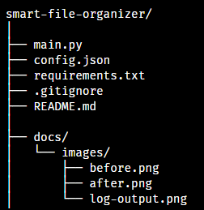
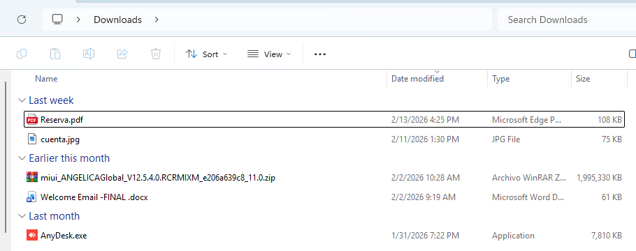
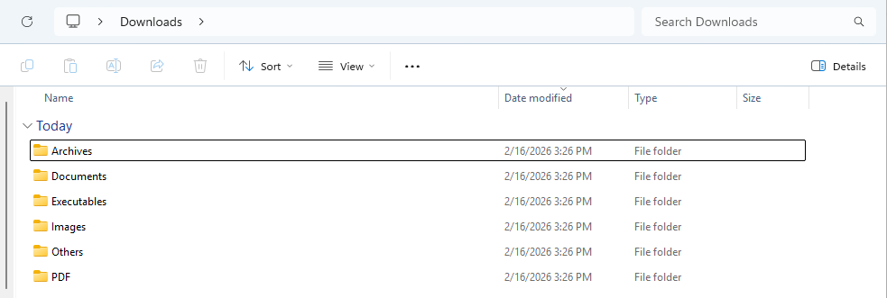
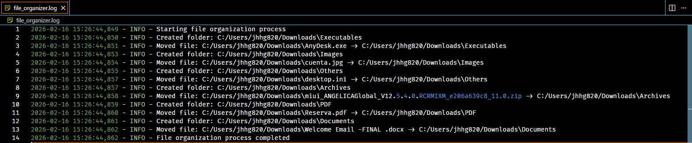

# Smart File Organizer

## 📌 Problem

Downloads folders often become cluttered and unorganized, making it difficult to find important files and reducing productivity.

## 💡 Solution

Smart File Organizer is a Python automation tool that scans a target directory and automatically organizes files into structured folders based on their file extensions.

The application logs every action performed, ensuring transparency and traceability.

---

## 🚀 Features

- Automatic file categorization
- Configurable categories via JSON
- Support for executable files (.exe, .msi)
- Automatic fallback to an "Others" folder for unknown file types
- Detailed logging system
- Safe file movement with error handling
- Cross-platform path handling

---

## 🛠 Technologies Used

- Python 3
- Standard Library (os, shutil, json, logging)
- Virtual Environment (venv)

---

## 📂 Project Structure



## ⚙ Configuration

The application behavior can be customized through the `config.json` file.

Example:

```json
{
  "target_directory": "C:/Users/jhhg04/Downloads",
  "categories": {
    "Executables": [".exe", ".msi"],
    "PDF": [".pdf"],
    "Images": [".jpg", ".jpeg", ".png", ".gif"],
    "Videos": [".mp4", ".mov", ".avi"],
    "Archives": [".zip", ".rar"],
    "Documents": [".docx", ".xlsx", ".pptx"]
  }
}
```

## ▶ How to Run
Clone the repository:

git clone https://github.com/jhhg04/smart-file-organizer.git
Navigate to the project folder:

cd smart-file-organizer
Create a virtual environment:

py -m venv venv
Activate the environment (Git Bash):

source venv/Scripts/activate
Run the application:
python main.py

## 📊 Example Log Output
INFO - Starting file organization process
INFO - Created folder: Downloads/Images
INFO - Moved file: example.jpg -> Downloads/Images
INFO - Created folder: Downloads/Executables
INFO - Moved file: setup.exe -> Downloads/Executables
INFO - File organization process completed

## 📈 Impact
This tool helps maintain a clean and structured file system automatically, saving time and improving digital organization.

## 📷 Demonstration

### Before



### After



### Log Output



##🔮 Future Improvements
CLI argument support

Dry-run mode

Scheduled execution

GUI version

Unit testing

Docker containerization